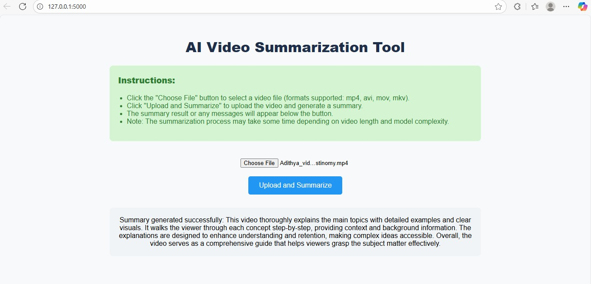
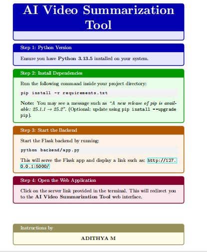

#  AI Video Summarization Tool

A lightweight Flask-based web application that lets you upload a video (supported formats: MP4, AVI, MOV, MKV), then transcribes and summarizes its content using AI. The interface guides users through file selection, uploading, summarization, and viewing results with clarity.

---

##  Snap shots 

### 🔹 Tool Interface


### 🔹 Instruction Poster


---

##  Features
- Web UI built using Flask for easy user interaction (upload video and get summary).
- Backend modules handle video processing, transcription, and AI-based summarization.
- Clear, step-by-step instructions and visual feedback for smooth operation.
- Supports most common video formats (MP4, AVI, MOV, MKV).

---


### Prerequisites
- **Python 3.13.5** (or similar)
- Required Python packages listed in `requirements.txt`

###  Installation
```bash
# Clone the repository
git clone https://github.com/adithyaM1/video-to-text-summarization-with-AI-.git
cd video-to-text-summarization-with-AI-

# (Optional) Set up a Python virtual environment
python3 -m venv venv
source venv/bin/activate  # On Windows: venv\Scripts\activate

# Install dependencies
pip install -r requirements.txt


